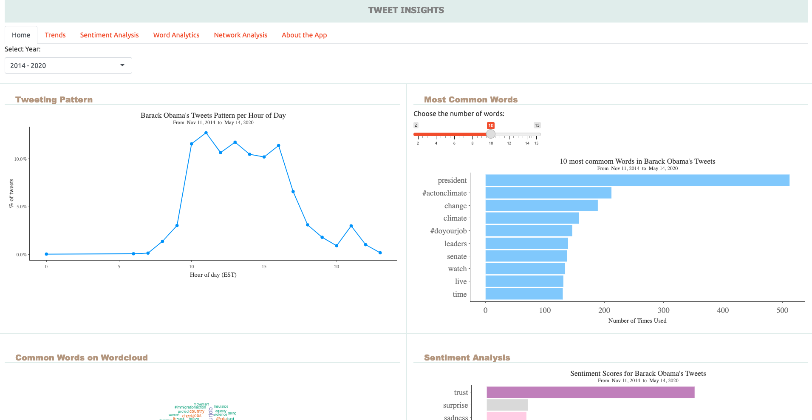

```{r setup, include=FALSE}
knitr::opts_chunk$set(echo = T,
                      warning = F,
                      message = F)

```

#  Project Instructions

In this project, the goal is to develop an interactive dashboard for analyzing Twitter (now X) data. While the focus is on mastering Shiny application development, the project provides a glimpse into `Sentiment Analysis`. 

As a participant of this workshop, your task involves: 

1. Building the application from scratch with inspiration from the base application provided. You can view the base application at [https://william-agyapong.shinyapps.io/tweet-insights/](https://william-agyapong.shinyapps.io/tweet-insights/). See a screenshot of the UI below. 

2. Extend the features (capabilities) of the base application. Here are some suggestions for extension: 
    - Personalize the app by using your preferred application layout (Checkout the [Iris dashboard codes](https://github.com/williamagyapong/workshops/blob/main/UTEP-Spring24/irisApp/app.R) we went over, and [Application Layout Guide](https://shiny.posit.co/r/articles/build/layout-guide/))
    - Tweeting Pattern: Provide options such as the ability for the user to change the unit or scale of the data plotted (percent, raw counts, log-scale, etc.), yearly comparisons such that the user is able to compare the trend across multiple years.
    
    - Most common words and sentiment dimensions plots can also benefit from multi-scale (raw count versus percent) data displays.
    
    - Show/hide the corresponding bar graph data values on each bar.
    
    - Switch between different plot themes (if you use `ggplot2` for plotting) or different color themes. 
    
    - Make the wordcloud and sentiment graph interactive. Think about providing some input controls to help tweak the behavior/look of the graphs. 


Codes for loading, preprocessing the data for analysis, and for generating graphs presented in the base application are provided towards the end of this document to give you a head start. Your ability to integrate these into the app would mean a great achievement towards our goal of equipping you with skills to be able to develop your own custom shiny applications. Note that, typically, you first run your analysis outside of shiny, making sure the basic functionalities work, and later translate that into a shiny application. It is our hope that this project gives you that feel and experience!

> There will be a **code along session** during the final part of the workshop on **April 5**. Participants are however encouraged to start the application on their own to reinforce the concepts introduced and enhance better understanding of Shiny app development. For nothing at all, try creating the dashboard layout and insert some of the graphs with or without interactivity (Task #1). *Happy coding...*

\newpage 


```{r, out.width="100%", out.height="100%", echo=FALSE}
# include image of application UI 

```


[Click to view app](https://william-agyapong.shinyapps.io/tweet-insights/)


\newpage 


# Data analysis codes to get you started

Download the source file containing the codes [here](https://github.com/williamagyapong/workshops/blob/main/UTEP-Spring24/project/final-project.Rmd). 

Make sure you have the following packages installed:

- `dplyr`: for manipulating your data
- `ggplot2`: for creating visualizations
- `stringr` and `tidytext`: for most text data and sentiment analysis tasks
- `lubridate`: for working with dates
- `scales`: formatting labels for axes and legends
- `wordcloud`
- `plotly` (optional): making interactive plots
<!-- - `ggExtra` (optional): extends `ggplot2` -->

*You can simply install the `tidyverse` package to give you access to `dplyr`, `ggplot2`, `stringr`, and `lubridate`*. 


```{r}
## load required packages
library(tidyverse)
library(tidytext)
library(lubridate)
library(scales)
library(wordcloud)

# for foramtting data frames into beautiful tables
library(knitr)
library(kableExtra)

```


## Data description and import


Data for the project consist of former president of the US, Barack Obama’s 2014 - 2020 tweets downloaded directly from X (Twitter), and it is made available in excel (csv) format on [Github](https://github.com/williamagyapong/workshops/tree/main/UTEP-Spring24/project). View the data [here](https://github.com/williamagyapong/workshops/blob/main/UTEP-Spring24/project/Obama_tweets_2014-2020.csv), and use the *download raw file* button located in the upper right end of the page to download the data. 

First few observations from the data are shown below. The `created_at` and `text` variables, providing the date and time when the tweet was posted, and the actual tweet post, respectively, are the main variables of interest.

```{r, echo=TRUE}
# assumes data is stored in the same location as this RMarkdown file

# set working directory to this file location
setwd(dirname(rstudioapi::getSourceEditorContext()$path))


# read-in the data
obama_tweets <- read.csv("obama_tweets_2014-2020.csv")


# view first few rows of data
head(obama_tweets) |>
  kable(booktab=T, 
        caption = paste("Original data, showing 6 observations out of",
                        nrow(obama_tweets))) |># for pretty looking table
    column_spec(c(1,4,5), width = "5em") |>
    column_spec(3, width = "20em") |>
    column_spec(4, width = "3em") |>
    kable_styling(latex_options = c("scale_down", "HOLD_position")) |>
    kable_classic() 

```


## Data Preprocessing 

Some data preprocessing is necessary to clean up the tweet text such as the removal of links and quotation marks, and transformation of the text into a structured format for analysis. The cleansed and tokenized version of data is shown below.


```{r, echo=TRUE}

#~~~~~~~~~~~~~~~~~~~~~~~~~~~~~~~~~~~~~~~~~~~~~~~~~~~~~~~~~~~~~~~~~~~~~~~~~~~~~~~~
#                          Cleaning and Transforming the Data
#~~~~~~~~~~~~~~~~~~~~~~~~~~~~~~~~~~~~~~~~~~~~~~~~~~~~~~~~~~~~~~~~~~~~~~~~~~~~~~~~

# Cast dates to the right type and remove redundant variables
# Dates in the original data retrieved directly from Twitter  were in "UTC" time zone
obama_tweets_clean <- obama_tweets |>
    mutate(date = as.Date(created_at),
           created_at = as.POSIXct(created_at, tz="UTC")) |>
  filter(!is_retweet) |> # sum(obama_tweets$is_retweet) == 0,
                         # indicating no retweets
  select(-is_retweet)


#--- create new columns
# Eastern standard time was used to reflect the tweet location time zone, EST,
# since we know that the user tweeted from Washington DC.
obama_tweets_clean <- obama_tweets_clean |>
  mutate(
    hour = hour(with_tz(created_at, "EST")),
    year = year(with_tz(created_at, "EST"))
  )


#--- some data cleansing is required to strip off unwanted characters and strings

# define a regex to capture Twitter special characters
pattern <- "([^A-Za-z\\d#@']|'(?![A-Za-z\\d#@]))" 

# 
tweet_words <- obama_tweets_clean |>
  # make sure we don't get words from quotes
  filter(!stringr::str_detect(text, '^"')) |>
  # remove links
  mutate(text = stringr::str_replace_all(text, "https://t.co/[A-Za-z\\d]+|&amp;", "")) |>
  # obtain individual words in tweet
  tidytext::unnest_tokens(word, text, token = "regex", pattern = pattern) |>
  # remove words that are not informative (called stop words)
  filter(!word %in% tidytext::stop_words$word & word!="http" & word!="obama") |> 
  # remove numeric characters
  filter(stringr::str_detect(word, "[a-z]")) 


# display first few observations
head(tweet_words) |>
  kable(booktab=T, linsep="",
        caption = paste("Cleaned and tokenized version of the data, showing 6 observations out of", nrow(tweet_words))) |>
   kable_styling(latex_options = c("HOLD_position", "scale_down")) |>
    kable_classic() 


# save data in a compressed format for shiny application 
if (T) {
    save(obama_tweets_clean, file = "obama_tweets_clean.RData")
    save(tweet_words, file = "tweet_words.RData")
}
```


## Tweeting Patterns

### Hourly tweeting pattern

```{r}

#----- Deriving hourly tweets in a day 
hourly_tweet <- obama_tweets_clean |>
  # get the frequency of tweets for each hour of the day
  count(hour) |> 
  # convert frequency (raw counts) to a percent
  mutate(percent = n / sum(n)) 

# visualizing hour of day tweets were posted
  ggplot(hourly_tweet, aes(hour, percent)) +
  geom_line(show.legend = FALSE, color="dodgerblue") +
  geom_point(show.legend = FALSE,color="dodgerblue") +
  scale_y_continuous(labels = percent_format()) +
  labs(x = "Hour of day (EST)", y = "% of tweets", color = "",
       title = "Barack Obama's tweeting pattern per hour of day",
       subtitle = paste("From ", format(obama_tweets_clean$date[length(obama_tweets_clean$date)],
                                        "%b %d, %Y"), " to ",
                        format(obama_tweets_clean$date[1],"%b %d, %Y"))) +
  theme_bw() +
  theme(plot.title = element_text(hjust = 0.5),
        plot.subtitle = element_text(hjust = 0.5)
        )
  
```

```{r compare-yearly-trend, eval=T, echo=T}

#----- Deriving hourly tweets in a day by year
hourly_tweet <- obama_tweets_clean |>
  # get the frequency of tweets for each hour of the day
  count(year, hour) |> 
  # convert frequency (raw counts) to a percent
  group_by(year) |>
  mutate(percent = n / sum(n)) 

# visualizing hour of day tweets were posted
  ggplot(hourly_tweet, aes(hour, percent, color = factor(year))) + 
      geom_line(show.legend = TRUE) +
      geom_point(show.legend = FALSE) +
      # facet_wrap(vars(year), scales = "free") + 
      scale_y_continuous(labels = percent_format()) +
      labs(x = "Hour of day (EST)", y = "% of tweets", color = "",
       title = "Barack Obama's tweeting pattern per hour of day by year",
       subtitle = paste("From ", format(obama_tweets_clean$date[length(obama_tweets_clean$date)],
                                        "%b %d, %Y"), " to ",
                        format(obama_tweets_clean$date[1],"%b %d, %Y"))) +
  theme_bw() +
  theme(plot.title = element_text(hjust = 0.5),
        plot.subtitle = element_text(hjust = 0.5)
        )
  
  
```
 

## Commonly used words via bar chart

```{r}
# get top 20 most frequently used words by Barack Obama
top_20_words <- tweet_words  |>
  group_by(word) |>
  summarise(frequency= n()) |>
  ungroup() |>
  arrange(desc(frequency)) |>
  top_n(20, frequency) |>
  mutate(word = reorder(word, frequency))

# create a bar chart of top 20 commonly used words
ggplot(top_20_words) +
  geom_bar(
    aes(x=word, y=frequency), fill = "dodgerblue", alpha=.7,stat="identity") +
  theme_classic() +
  labs(x="Words", y="Number of Times Used",
       title="20 most commom words in Barack Obama's Tweets") +
  theme(legend.position = "none",
        panel.grid.major = element_blank(),
        panel.grid.minor = element_blank(),
        axis.text=element_text(size=14),
        plot.title = element_text(size=18, hjust = 0.5)
  ) +
  coord_flip()


```


## Commonly used words via wordcloud

```{r}
#~~~~~~~~~~~~~~~~~~~~~~~~~~~~~~~~~~~~~~~~~~~~~~~~~~~~~~~~~~~~~~~~~~~~~~~~~~
# Displaying most commonly used words using wordcloud 
#~~~~~~~~~~~~~~~~~~~~~~~~~~~~~~~~~~~~~~~~~~~~~~~~~~~~~~~~~~~~~~~~~~~~~~~~~~

# setting seed for reproducibility of same results
set.seed(22222)

# most common words from Obama
tweet_words %>%
  anti_join(stop_words, by = "word") %>%
  count(word) %>%
  with(wordcloud(word, n, max.words = 100,
                 random.order=FALSE,
                 colors= brewer.pal(8,"Dark2"),
                 scale = c(3,0.5)))

```

## Sentiment Analysis

### Deriving sentiment scores

```{r}
#~~~~~~~~~~~~~~~~~~~~~~~~~~~~~~~~~~~~~~~~~~~~~~~~~~~~~~~~~~~~~~~~~~~~~~~~~~
#    Sentiment Analysis
#~~~~~~~~~~~~~~~~~~~~~~~~~~~~~~~~~~~~~~~~~~~~~~~~~~~~~~~~~~~~~~~~~~~~~~~~~

# using the nrc lexicon to assign appropriate sentiment to words
sentiments <- get_sentiments("nrc")
# pos_neg_sentiments <- get_sentiments("bing") # classify words as either
                                               # positive/negative
#~~~~~~~~~~~~~~~~~~~~~~~~~~~~~~~~~~~~~~~~~~~~~~~~~~~~~~~~~~~~~~~~~~~~~~~~~~
# Displaying most commonly used words using wordcloud 
#~~~~~~~~~~~~~~~~~~~~~~~~~~~~~~~~~~~~~~~~~~~~~~~~~~~~~~~~~~~~~~~~~~~~~~~~~~

# setting seed for reproducibility of same results
set.seed(22222)

# most common words from Obama
tweet_words %>%
  anti_join(stop_words, by = "word") %>%
  count(word) %>%
  with(wordcloud(word, n, max.words = 100,
                 random.order=FALSE,
                 colors= brewer.pal(8,"Dark2"),
                 scale = c(3,0.5)))

# count and compare the frequencies of each sentiment appearing in each device
  sentiment_summary <- tweet_words |>
  left_join(sentiments, by = "word") |>
  count(screen_name, sentiment) |> # find sentiment score
  spread(screen_name, n) |>
  rename(score = BarackObama) |>
  filter(!is.na(sentiment))
```


### Visualizing the scores
```{r}
# Creating a barplot to visualize sentiment scores
  ggplot(sentiment_summary) +
    geom_bar(
      aes(x=sentiment, y=score, fill=sentiment),
      stat="identity") +
    scale_fill_brewer(palette = "Set3") +
    theme_classic()+
    labs(x="Sentiment", y="Score",
         title="Sentiment Scores for Barack Obama's Tweets",
         caption = "\n Source: Data collected from Twitter's REST API via rtweet") +
    theme(legend.position = "none",
          panel.grid.major = element_blank(),
          panel.grid.minor = element_blank(),
          plot.caption = element_text(size = 13, face = "italic", hjust = 0,vjust = 0),
          axis.text=element_text(size=14),
          plot.title = element_text(size=18, hjust = 0.5)
    ) +
    coord_flip()

```


